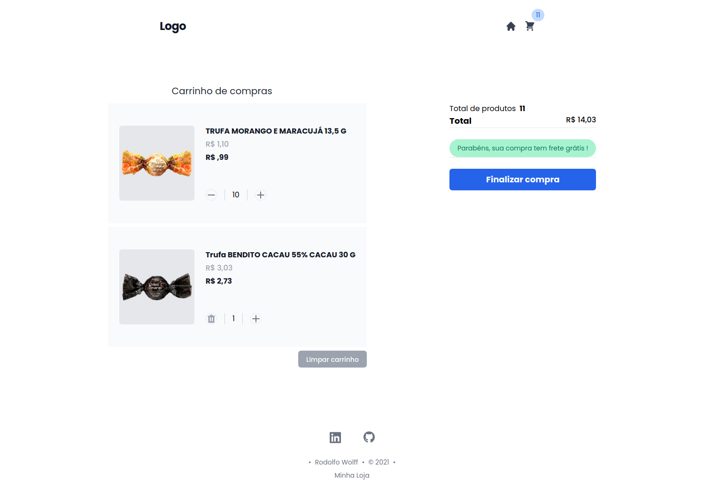

# Desafio carrinho de compras
#### CARRINHO DE COMPRAS

## Projeto
A api (fake) é um arquivo JSON com os itens e suas devidas informações.

## Funcionalidades e Observações

- [x] - Listar produtos
- [x] - Adicionar um novo produto ao carrinho
- [x] - Alterar a quantidade de um produto no carrinho
- [x] - Cálculo dos preços sub-total e total do carrinho
- [x] - Limpar carrinho
- [x] - Mensagem Frete grátis compras acima de R$ 10,00
- [ ] - Teste

  

  

  

## Recomendações
#### Projeto*Projeto feito com:
- [React](https://reactjs.org)
- [Tailwindcss](https://tailwindcss.com/)

Projeto feito com tres branch (main, style e development), basta digitar o comando git checkout nomeDaBranch que deseja.

## Acesso ao desafio
#### Para acessar clique no link abaixo:
    swagger: https://carinho-de-compras.vercel.app/

## 📝 Novidades

    LAYOUT
        Add Responsividade (flex)
        Add Page 404 customizada

---

Feito com ♥ by Rodolfo Wolff 👋🏻 [Desafio Front-end]